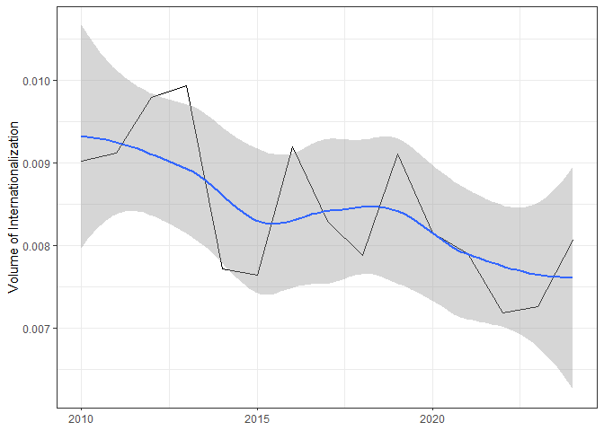
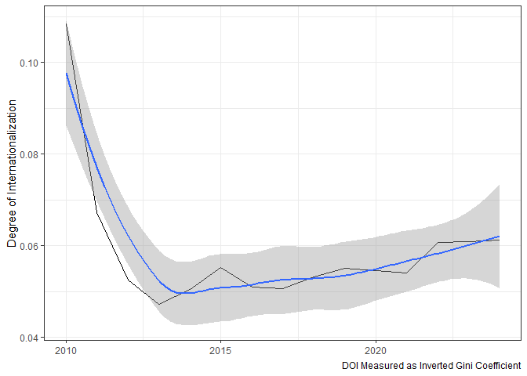

# globaltrends Firms

A Google Trends-Based Measure of Firm Internationalization

The current version of the **globaltrends Firms** dataset can be
accessed:

- Country-level search score data by firm
  ([parquet](https://github.com/ha-pu/globaltrends_firms/blob/main/firms_score.parquet))
- Volume of internationalization data by firm
  ([xlsx](https://github.com/ha-pu/globaltrends_firms/blob/main/firms_voi.xlsx),
  [parquet](https://github.com/ha-pu/globaltrends_firms/blob/main/firms_voi.parquet))
- Degree of internationalization data by firm
  ([xlsx](https://github.com/ha-pu/globaltrends_firms/blob/main/firms_doi.xlsx),
  [parquet](https://github.com/ha-pu/globaltrends_firms/blob/main/firms_doi.parquet))

Cite any usage of the **globaltrends Firms** data as: Puhr, H., &
Müllner, J. (2021). Let me Google that for you: Capturing globalization
using Google Trends (SSRN Working Paper 3969013). Available at
<https://www.ssrn.com/abstract=3969013>.

The **globaltrends Firms** data is part of the [globaltrends
project](https://github.com/ha-pu/globaltrends).

- Last update of the data: 2025-11-29
- Coverage of the data: 2010-2024

## Volume of Internationalization

### Average Annual Volume of Internationalization

## Degree of Internationalization

### Average Annual Degree of Internationalization

